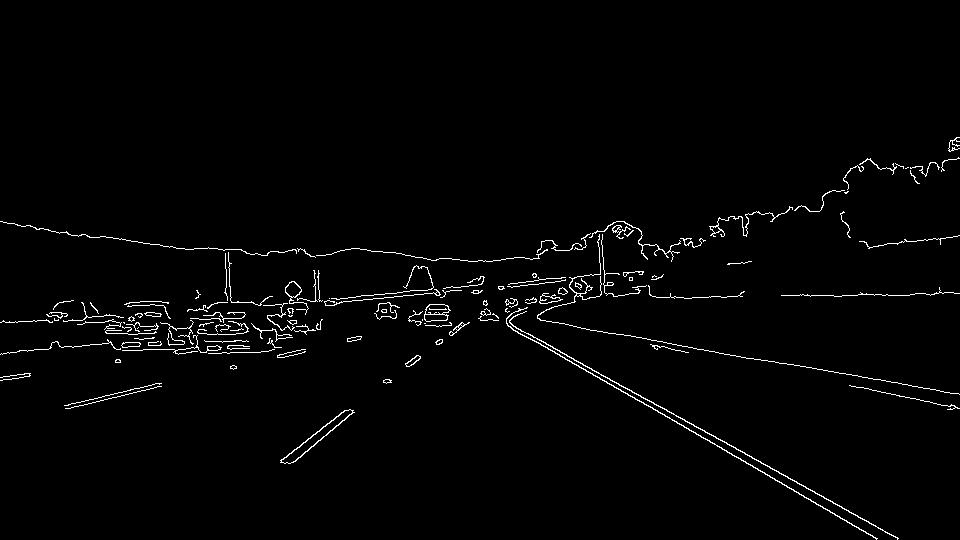
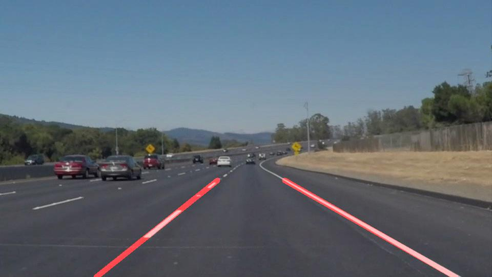

# **Detecting Lane Lines on the Road**

---

The goal of this project is to model a pipeline that detects lane lines on the road. 
The pipeline processes each frame of a video stream and marks lane lines on them.

---

## Lane Line Detection Pipeline

The lane line detection pipeline consists of the following steps:

1. Convert image to grayscale
2. Smooth grayscaled image using gaussian kernel
3. Apply Canny transform on smoothed image to detect edges
4. Mask edges using a quadriateral mask
5. Apply Hough transform on masked image 
6. Draw lines extracted from hough transform on a blank image
7. Use lines on blank image to draw lane lines on original image

## Modified Lane Line Detection Pipeline

To draw a single line on the left and right lanes, the following approach was adapted:

Average the slopes and intercepts of the left and right set of lines weighed 
by their lengths. Use weighted_average_slope and weighted_average_intercept to 
draw lines of fixed length from the bottom of a blank image.

### 1. Pipeline Demo

1. Convert image to grayscale

2. Smooth grayscaled image using gaussian kernel
3. Apply Canny transform on smoothed image to detect edges

4. Mask edges using a quadriateral mask

5. Apply Hough transform on masked image
6. Compute weighted average of slopes and intercepts for left and right set of lines
7. Using weighted average slopes and intercepts, compute end point coordinates for left and
   right lines that end at the bottom of a blank image
8. Draw left and right lines on the blank image using the end point coordinates computed
   in the previous step
   

9. Use lines on blank image to draw lane lines on original image

### 2. Potential shortcomings

1) Not suited to detect curved lane lines
2) Lines fluctuate across frames
3) Bright points outside the lane get detected and disturb line markings

### 3. Possible improvements

1) Curved lines could be captured by 
   - Dividing masked images into grids and using the current approach
   - Constraining max_length of lines to a very small value
   - Fit piecewise linear model to the output of canny transform
2) To stabilize lines across frames, slopes and intercepts of left and right lines 
   could be averaged across a moving window of frames.
3) Better masks or outlier detection techniques could alleviate the problem of detecting bright  
   points outside the lane

Another approach could be to fit a polynomial Bayesian regression model on a moving window of the masked Canny images (step 4 of 'Modified Lane Detection Pipeline'). The priors/posteriors of the weights would not only capture curved lines on the road, they would also stabilize line markings across frames by marginalising model estimates and by detecting/avoiding outliers. A closed form solution ensures computational efficiency as well.
